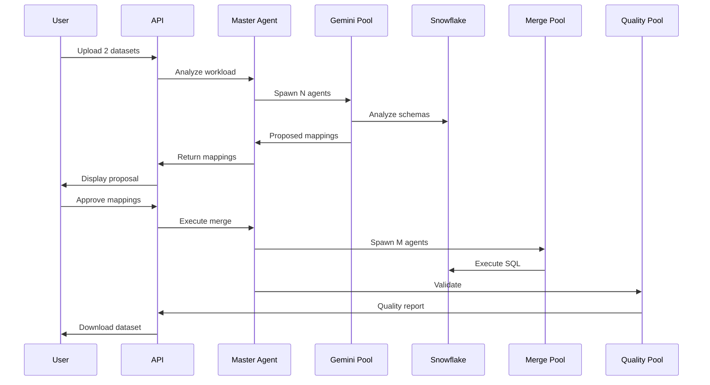

# EY Data Integration SaaS - Backend

AI-powered data integration platform for EY using **Gemini 2.5 Pro** and **Snowflake**.

## Overview

This is a **hackathon MVP** backend that automates data integration with intelligent schema mapping, conflict resolution, and quality validation. The system uses a **multi-agent architecture** that simulates cloud-native (Kubernetes-ready) deployment.

## Key Features

- 🤖 **Multi-Agent System**: Master Agent orchestrates specialized agent pools (Gemini, Snowflake, Merge, Quality)
- 🧠 **Gemini 2.5 Pro**: Semantic schema understanding and intelligent column mapping
- ❄️ **Snowflake-Native**: All data operations executed in Snowflake (no local pandas processing)
- 🎯 **Autonomous Resource Allocation**: Master Agent decides how many agents to spawn based on workload
- 📊 **Jira Integration**: Automatic escalation for conflicts and low-confidence mappings
- 🔄 **Real-time Updates**: WebSocket support for live progress tracking
- 🐳 **Docker-Ready**: Containerized for Kubernetes deployment demo

## Architecture

```
┌─────────────────────────────────────────────────────────────┐
│                      FRONTEND (Separate Team)                │
└──────────────────────┬──────────────────────────────────────┘
                       │ REST API + WebSocket
                       ▼
┌─────────────────────────────────────────────────────────────┐
│                    FASTAPI BACKEND                           │
│  Routes: /upload, /analyze, /approve, /merge, /validate     │
└──────────────────────┬──────────────────────────────────────┘
                       │
        ┌──────────────┴──────────────┐
        ▼                             ▼
┌───────────────────┐         ┌──────────────────┐
│  MASTER AGENT     │────────▶│  ORCHESTRATION   │
│  (Decision Maker) │         │  (Agent Spawner) │
└────────┬──────────┘         └──────────────────┘
         │
    ┌────┴────┬────────┬──────────┬──────────┐
    ▼         ▼        ▼          ▼          ▼
┌────────┐ ┌─────┐ ┌────────┐ ┌────────┐ ┌────────┐
│ GEMINI │ │SNOW │ │ MERGE  │ │QUALITY │ │  JIRA  │
│ AGENTS │ │AGENTS│ │ AGENTS │ │ AGENTS │ │ AGENT  │
│  (N)   │ │ (N)  │ │ (1-10) │ │  (5)   │ │  (1)   │
└────┬───┘ └──┬──┘ └────┬───┘ └────┬───┘ └───┬────┘
     │        │         │          │          │
     └────────┴─────────┴──────────┴──────────┘
                       │
                       ▼
              ┌─────────────────┐
              │ SNOWFLAKE API   │
              │ (Data Platform) │
              └─────────────────┘
```

## Setup

### Prerequisites

- Python 3.10+
- Snowflake account
- Google Gemini API key
- (Optional) Jira account for conflict escalation

### Installation

1. **Clone and navigate to project:**
   ```bash
   cd /path/to/local
   ```

2. **Create virtual environment:**
   ```bash
   python -m venv venv
   source venv/bin/activate  # On Windows: venv\Scripts\activate
   ```

3. **Install dependencies:**
   ```bash
   pip install -r requirements.txt
   ```

4. **Configure environment:**
   ```bash
   cp .env.example .env
   # Edit .env with your credentials
   ```

5. **Required Environment Variables:**
   ```bash
   # Snowflake (REQUIRED)
   SNOWFLAKE_ACCOUNT=your_account.region
   SNOWFLAKE_USER=your_user
   SNOWFLAKE_PASSWORD=your_password
   SNOWFLAKE_WAREHOUSE=your_warehouse
   SNOWFLAKE_DATABASE=EY_DATA_INTEGRATION
   
   # Gemini (REQUIRED)
   GEMINI_API_KEY=your_gemini_api_key
   GEMINI_MODEL=gemini-2.5-pro
   
   # Jira (OPTIONAL)
   JIRA_ENABLED=false  # Set to true to enable
   JIRA_URL=https://your-domain.atlassian.net
   JIRA_EMAIL=your-email@example.com
   JIRA_API_TOKEN=your_jira_token
   ```

### Run the Application

```bash
# Development mode (with auto-reload)
python main.py

# Or using uvicorn directly
uvicorn main:app --reload --host 0.0.0.0 --port 8000
```

The API will be available at:
- **API**: http://localhost:8000
- **Interactive Docs**: http://localhost:8000/docs
- **ReDoc**: http://localhost:8000/redoc

## API Endpoints

### 1. Upload Datasets
```bash
POST /api/v1/upload
Content-Type: multipart/form-data

# Upload two CSV/Excel files
curl -X POST http://localhost:8000/api/v1/upload \
  -F "dataset1=@examples/dataset1_customers.csv" \
  -F "dataset2=@examples/dataset2_clients.csv"

# Response:
{
  "session_id": "abc123",
  "status": "uploaded",
  "dataset1": {...},
  "dataset2": {...}
}
```

### 2. Analyze Schemas
```bash
POST /api/v1/analyze
Content-Type: application/json

{
  "session_id": "abc123"
}

# Response: Mappings proposed by Gemini 2.5 Pro
{
  "status": "ready_to_merge",
  "mappings": [...],
  "conflicts": [...],
  "schema_analysis": {...}
}
```

### 3. Approve & Merge
```bash
POST /api/v1/approve
Content-Type: application/json

{
  "session_id": "abc123",
  "approved_mappings": [...],
  "merge_type": "full_outer"
}

# Response:
{
  "job_id": "merge_abc123_xyz789",
  "status": "in_progress",
  "agents_spawned": {
    "merge_agents": 5,
    "quality_agents": 5
  }
}
```

### 4. Check Status
```bash
GET /api/v1/status/{job_id}

# Response:
{
  "job_id": "merge_abc123_xyz789",
  "status": "in_progress",
  "progress_percentage": 75,
  "logs": [...]
}
```

### 5. Validate Quality
```bash
POST /api/v1/validate?session_id=abc123

# Response: Quality report
{
  "overall_status": "passed",
  "checks": {...},
  "recommendations": [...]
}
```

### 6. Download Results
```bash
GET /api/v1/download/{session_id}?format=csv

# Downloads merged dataset
```

## MVP Flow (End-to-End)



## Agent Allocation Logic

Master Agent **autonomously decides** agent counts:

| Dataset Size | Complexity | Gemini Agents | Merge Agents | Warehouse |
|--------------|------------|---------------|--------------|-----------|
| < 10K rows   | Low        | 1             | 1            | X-SMALL   |
| 10K-100K     | Medium     | 2             | 3            | MEDIUM    |
| 100K-1M      | High       | 3             | 7            | X-LARGE   |
| > 1M         | Any        | 3             | 10           | X-LARGE   |

## Conflict Escalation (Jira)

When Gemini detects conflicts:
- **Confidence < 70%** → Create Jira story
- **Type mismatch** → Create Jira story
- **Ambiguous mapping** → Create Jira story

Example Jira Story:
```
Title: Data Integration Conflict - Session abc123
Description: 
  Ambiguous column mapping detected:
  - Dataset A: created_date (DATE)
  - Dataset B: signup_timestamp (TIMESTAMP)
  - Confidence: 60%
  
  Proposed Resolutions:
  1. Cast both to DATE
  2. Cast both to TIMESTAMP
  3. Keep as separate columns
  
Priority: High
Labels: data-integration, auto-created
```

## Example Datasets

Test datasets are provided in `examples/`:
- **dataset1_customers.csv**: Customer data with cust_id, email_addr, etc.
- **dataset2_clients.csv**: Client data with customer_number, contact_email, etc.

Intentional conflicts for testing:
- Column name differences (cust_id vs customer_number)
- Email case differences (john@example.com vs JOHN@EXAMPLE.COM)
- Overlapping but not identical data

## Development

### Project Structure

```
local/
├── agents/              # Multi-agent system
│   ├── master_agent.py  # Orchestrator
│   ├── gemini/          # Gemini 2.5 Pro agents
│   ├── snowflake/       # Snowflake operations
│   ├── merge/           # Merge agent pool
│   ├── quality/         # Quality validation
│   └── integration_agents/  # Jira, Datadog
├── api/                 # FastAPI routes
├── core/                # Configuration & infrastructure
├── snowflake/           # Snowflake connection & management
├── examples/            # Sample datasets
├── main.py              # Application entry point
└── requirements.txt     # Dependencies
```

### Adding New Agents

1. Create agent class in appropriate directory
2. Implement `execute(task)` method
3. Register with agent pool manager
4. Update Master Agent orchestration logic

Example:
```python
class MyNewAgent:
    def __init__(self, agent_id: str, config: Dict):
        self.agent_id = agent_id
    
    async def execute(self, task: Dict[str, Any]) -> Any:
        # Agent logic here
        pass
```

## Docker Deployment (K8s-Ready)

```bash
# Build image
docker build -t ey-data-integration .

# Run container
docker run -p 8000:8000 --env-file .env ey-data-integration

# Or use docker-compose for multi-container simulation
docker-compose up
```

## Troubleshooting

### Snowflake Connection Issues
```bash
# Check credentials in .env
# Ensure warehouse is running
# Verify network access to Snowflake
```

### Gemini API Errors
```bash
# Verify GEMINI_API_KEY is correct
# Check API quota
# Ensure model is "gemini-2.5-pro"
```

### Jira Integration Not Working
```bash
# Set JIRA_ENABLED=false to disable
# Or verify JIRA_API_TOKEN is valid
# Check JIRA_PROJECT_KEY exists
```

## Roadmap Completion Status

- ✅ Phase 1: Foundation (Config, Snowflake, FastAPI)
- ✅ Phase 2: Core Agents (Master, Gemini, Snowflake Ingestion)
- ✅ Phase 3: Merge Pipeline (SQL Generator, Merge Agents)
- ⚠️ Phase 4: Quality & Integrations (Partial - Jira mockable)
- ⏳ Phase 5: MCP Tools (Placeholder)
- ⏳ Phase 6: Polish (WebSocket basic, Docker ready)

## Demo Script

1. **Start server**: `python main.py`
2. **Upload datasets**: Use examples/ datasets
3. **Analyze**: Master Agent spawns Gemini agents
4. **Show mappings**: Gemini 2.5 Pro proposals
5. **Approve**: Trigger merge with agent pool
6. **Validate**: Quality checks
7. **Download**: Merged dataset

**Demo talking points:**
- "Master Agent autonomously decided to spawn X agents"
- "Gemini 2.5 Pro detected Y conflicts, created Jira tickets"
- "All operations executed in Snowflake, no local processing"
- "System is containerized and Kubernetes-ready"

## Support

For hackathon questions, refer to the detailed roadmap document.

## License

Hackathon MVP - Internal Use Only

---

**Built for EY Hackathon** | Powered by Gemini 2.5 Pro & Snowflake ❄️

